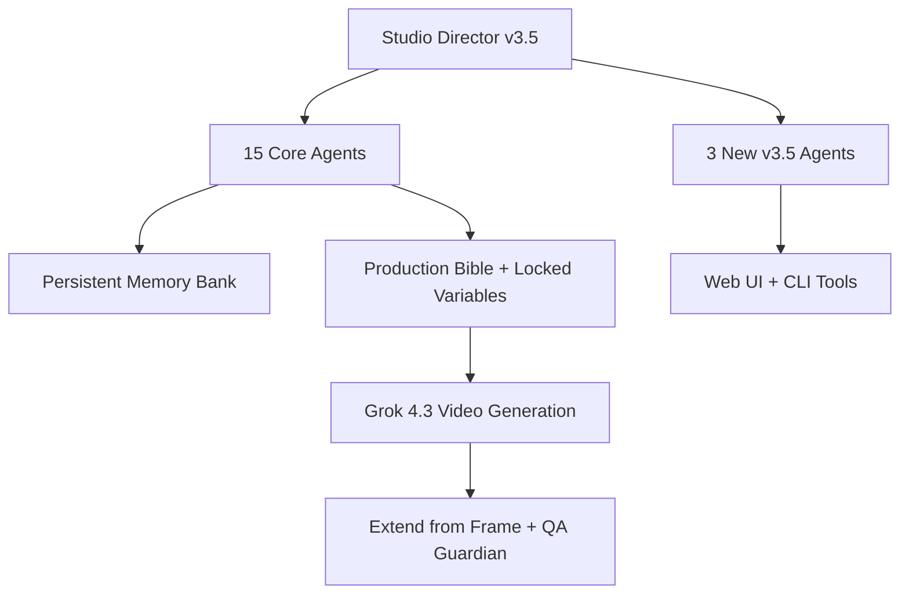

# 🎬 Grok Imagine Cinematic Studio v3.5

**The most advanced multi-agent cinematic production system for Grok 4.3 Beta**

Transform any story into emotionally powerful, production-ready cinematic video with perfect character consistency, persistent memory, and a full 18-agent professional film crew.

[](https://github.com/FineComputer14451/grok-imagine-cinematic-studio)
[](LICENSE)
[](https://x.ai)
[](https://github.com/FineComputer14451/grok-imagine-cinematic-studio/stargazers)

---

## ✨ What's New in v3.5 (May 28, 2026)

- **18 Specialized Agents** (6 new in v3.5)
- **Full Python CLI Toolkit** — Memory management, cost simulation, PDF reports, director signatures, project initialization
- **Beautiful Streamlit Web UI** — Visual prompt builder, character memory, cost simulator
- **5 Professional Production Bible Examples** across major genres
- **Persistent Character Memory Bank** with cross-session support
- **Native Extend from Frame** + enhanced long-form sequencing (60–180s+)
- **Pre-Generation Cost Simulator** with tier-specific pricing
- **Comparative QA + Self-Improvement Loop** (7 metrics)

---

## 🚀 Quick Start (Choose Your Method)

### Method 1: Original Prompt (Fastest)
1. Copy the entire content of `MASTER_PROMPT_v3.4.md`
2. Paste into a new **Grok 4.3 Beta** chat
3. Type: `Activate Grok Imagine Cinematic Studio v3.5`
4. Choose workflow A–E

### Method 2: Python CLI (Recommended for Power Users)
```bash
pip install typer rich fpdf2
python tools/cinematic_studio_cli.py --help

# Examples
python tools/cinematic_studio_cli.py memory add --name "Elara Voss" --dna "..."
python tools/cinematic_studio_cli.py generate-prompt --story "Your story here" --signature "villeneuve-deakins"
python tools/cinematic_studio_cli.py cost --seconds 120 --style dramatic
```

### Method 3: Streamlit Web UI (Most Beautiful)
```bash
pip install streamlit
streamlit run web_ui/app.py
```

---

## 🏗️ System Architecture



**Core Components:**
- `MASTER_PROMPT_v3.4.md` — Main activation prompt
- `agents/` — 18 specialized agent definition files
- `tools/cinematic_studio_cli.py` — Full-featured CLI
- `web_ui/app.py` — Streamlit frontend
- `examples/` — 5 ready-to-use Production Bibles

---

## 🎥 The 18-Agent Professional Film Crew

### Core v3.4 Agents (15)
Studio Director • Imagine Prompt Master • Mega Production Architect • Identity Lock Specialist • Continuity Guardian • Director of Photography • Performance & Emotion Director • Sonic Architect • Narrative Arc Strategist • Color Grading Supervisor • Workflow Quota Optimizer • Sequence Director • Quality Assurance Guardian • ErosForge NSFW Director • Cinematic Sequence Extender

### New v3.5 Agents (6)
- **VFX & SFX Supervisor**
- **Production Designer / Set Decorator**
- **Trailer & Teaser Director**
- **Localization & Subtitle Specialist**
- **Stunt & Action Choreographer**
- **Foley & Sound Design Specialist**
- **Key Art & Poster Designer** *(bonus)*

---

## 📁 Example Production Bibles

Located in `/examples/`:

| File | Genre | Director Signature |
|------|-------|--------------------|
| `sci_fi_neon_eclipse_heist.md` | Cyberpunk Heist | Villeneuve + Deakins |
| `psychological_horror_the_house_that_remembers.md` | Slow-burn Horror | Ari Aster |
| `intimate_drama_the_last_letter.md` | Quiet Emotional Drama | Roger Deakins |
| `action_midnight_run.md` | High-Octane Chase | Christopher Nolan |
| `surreal_echoes_in_the_static.md` | Experimental/Surreal | Ari Aster + Wes Anderson |

---

## 🛠️ Tools & Features

- **CLI Commands**: `memory`, `cost`, `generate-prompt`, `signature`, `report`, `backup`, `validate`, `agents`
- **Web UI**: Visual story input, agent toggles, director signatures, live cost simulation, character memory
- **PDF Reports**: Professional production reports with one click
- **Director Signatures**: 6 iconic styles (Villeneuve, Nolan, Deakins, Aster, Anderson, etc.)

---

## 📦 Installation

```bash
git clone https://github.com/FineComputer14451/grok-imagine-cinematic-studio.git
cd grok-imagine-cinematic-studio

# For CLI
pip install -r requirements.txt

# For Web UI
pip install -r requirements-streamlit.txt
streamlit run web_ui/app.py
```

**Requirements**: Grok 4.3 Beta (or newer) with video generation access + SuperGrokPro/Heavy recommended for long productions.

---

## 🗺️ Roadmap

**Completed in v3.5**
- Persistent Memory Bank
- 6 New Specialized Agents
- Full Python CLI + PDF Export
- Streamlit Web UI
- 5 Genre Example Bibles
- Enhanced Cost Simulator

**Coming in v3.6**
- Automatic video stitching & export
- Community Agent Marketplace
- Mobile-friendly templates
- Deeper Grok 4.4+ native integration

---

## 🤝 Contributing

We welcome contributions! Please see `CONTRIBUTING.md` for:
- How to propose new agents
- Production Bible submission guidelines
- Bug reports and feature requests

---

## 📜 License

MIT License — Free to use, modify, and share.

---

**Built with ❤️ for cinematic AI storytelling**

*Transforming ideas into cinema, one frame at a time.*

**Version 3.5 — May 28, 2026**