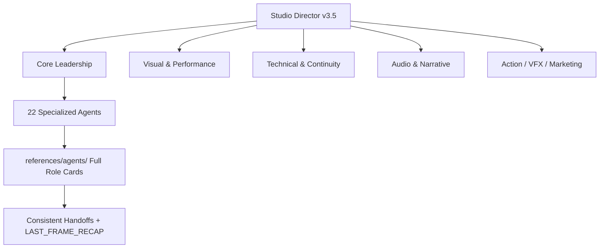

<p align="center">
  
</p>

# 🎬 Grok Imagine Cinematic Studio v3.5

**The most advanced multi-agent cinematic production system for Grok 4.3 Beta**

Transform any story into emotionally powerful, production-ready cinematic video with perfect character consistency, persistent memory, and a full **22-agent** professional film crew.

[](https://github.com/FineComputer14451/grok-imagine-cinematic-studio)
[](LICENSE)
[](https://x.ai)
[](https://github.com/FineComputer14451/grok-imagine-cinematic-studio/stargazers)

---

## ✨ What's New in v3.5

- **22 Specialized Agents** (with full v4.0 personalities)
- **Authoritative Role Cards** in `references/agents/` — Complete Core Mission, Upgrades, Protocols, Decision Frameworks, and Activation Triggers for every agent
- **Full Python CLI Toolkit** — Memory management, cost simulation, PDF reports, director signatures, project initialization
- **Beautiful Streamlit Web UI** — Visual story input, agent toggles, live cost simulator, director signatures
- **5 Professional Production Bible Examples** across major genres
- **Persistent Character Memory Bank** with cross-session support
- **Native Extend from Frame** + advanced long-form sequencing (60–120s+)
- **Pre-Generation Cost Simulator** + real-time quota optimization
- **Comparative QA + 7-Metric Self-Improvement Loop**
- **Improved CI Workflow** with Role Card validation and configurable `validation_mode`

---

## 🚀 Quick Start (Choose Your Method)

### Method 1: Master Prompt (Fastest)
1. Copy the content of `MASTER_PROMPT_v3.5.md`
2. Paste into a **new Grok 4.3 Beta** chat
3. Type: `Activate Grok Imagine Cinematic Studio v3.5`
4. Choose your workflow

### Method 2: Python CLI (Recommended for Power Users)
```bash
pip install -r requirements.txt
python tools/cinematic_studio_cli.py --help

# Examples
python tools/cinematic_studio_cli.py generate-prompt --story "Your story here"
python tools/cinematic_studio_cli.py cost --seconds 90 --style cinematic
```

### Method 3: Streamlit Web UI (Most Visual)
```bash
pip install -r requirements-streamlit.txt
streamlit run web_ui/app.py
```

---

## 🏗️ System Architecture



**Core Components:**
- `MASTER_PROMPT_v3.5.md` — Main activation prompt
- `references/agents/` — **22 authoritative Role Cards** (recommended source of truth)
- `agents/` — Agent definition files
- `.grok/skills/grok-imagine-cinematic-studio/` — Skill activation files
- `tools/cinematic_studio_cli.py` — Full-featured CLI
- `web_ui/app.py` — Streamlit frontend
- `examples/` — 5 ready-to-use Production Bibles

---

## 🎥 The 22-Agent Professional Film Crew

### Core Leadership
- **Studio Director v3.5**
- **Mega Production Architect v3.5**

### Visual & Camera
- **Director of Photography (DoP) v3.5**
- **Post-Production Color Grading Supervisor v3.5**
- **Production Designer / Set Decorator v3.5**

### Story & Performance
- **Performance & Emotion Director v3.5**
- **Identity Lock Specialist v3.5**
- **Narrative Arc & Pacing Strategist v3.5**
- **Sequence Director v3.5**
- **Cinematic Sequence Extender v3.5**

### Technical & Continuity
- **Continuity & Consistency Guardian v3.5**
- **Quality Assurance Guardian v3.5**
- **Imagine Prompt Master v3.5**
- **Workflow & Quota Optimizer v3.5**

### Audio
- **Sonic Architect Native Audio Virtuoso v3.5**
- **Foley Sound Design Specialist v3.5**

### Action, VFX & SFX
- **Stunt & Action Choreographer v3.5**
- **VFX & SFX Supervisor v3.5**

### Marketing & Distribution
- **Key Art & Poster Designer v3.5**
- **Trailer & Teaser Director v3.5**
- **Localization & Subtitle Specialist v3.5**

### Specialist
- **ErosForge NSFW Director v3.5** (opt-in only)

> All agents have complete **Role Cards** stored in `references/agents/`.

---

## 📁 Example Production Bibles

Located in `/examples/`:

| File | Genre | Recommended Director Signature |
|------|-------|--------------------------------|
| `sci_fi_neon_eclipse_heist.md` | Cyberpunk Heist | Villeneuve + Deakins |
| `psychological_horror_the_house_that_remembers.md` | Slow-burn Horror | Ari Aster |
| `intimate_drama_the_last_letter.md` | Quiet Emotional Drama | Roger Deakins |
| `action_midnight_run.md` | High-Octane Chase | Christopher Nolan |
| `surreal_echoes_in_the_static.md` | Experimental / Surreal | Ari Aster + Wes Anderson |

---

## 🛠️ Tools & Features

- **CLI Commands**: `memory`, `cost`, `generate-prompt`, `signature`, `report`, `backup`, `validate`, `agents`
- **Web UI**: Visual story input, agent toggles, director signatures, live cost simulation, character memory
- **PDF Reports**: Professional production reports with one click
- **Director Signatures**: Multiple iconic styles (Villeneuve, Nolan, Deakins, Aster, Anderson, etc.)
- **Role Card System**: Every agent has a structured, versioned Role Card with Core Mission, v3.5 Upgrades, Decision Frameworks, and Activation Triggers

---

## 📦 Installation

```bash
git clone https://github.com/FineComputer14451/grok-imagine-cinematic-studio.git
cd grok-imagine-cinematic-studio

# For CLI
pip install -r requirements.txt

# For Web UI
pip install -r requirements-streamlit.txt
streamlit run web_ui/app.py
```

**Requirements**: Grok 4.3 Beta (or newer) with video generation access. SuperGrokPro or SuperGrok Heavy recommended for long productions.

---

## 🗺️ Roadmap

**Completed in v3.5**
- Full 22-agent system with v4.0 personalities
- Authoritative Role Cards in `references/agents/`
- Improved CI workflow with Role Card validation
- Enhanced long-form sequencing & consistency tools
- Native audio + foley support
- Expanded NSFW cinematic capabilities (ErosForge)

**Coming in v3.6**
- Automatic video stitching & export
- Community Agent Marketplace
- Mobile-friendly templates
- Deeper Grok 4.4+ native integration

---

## 🤝 Contributing

We welcome contributions! Please see `CONTRIBUTING.md` for:
- How to propose new agents
- Production Bible submission guidelines
- Bug reports and feature requests

---

## 📜 License

MIT License — Free to use, modify, and share.

---

**Built with ❤️ for cinematic AI storytelling**

*Transforming ideas into cinema, one frame at a time.*

**Version 3.5 — June 2026**