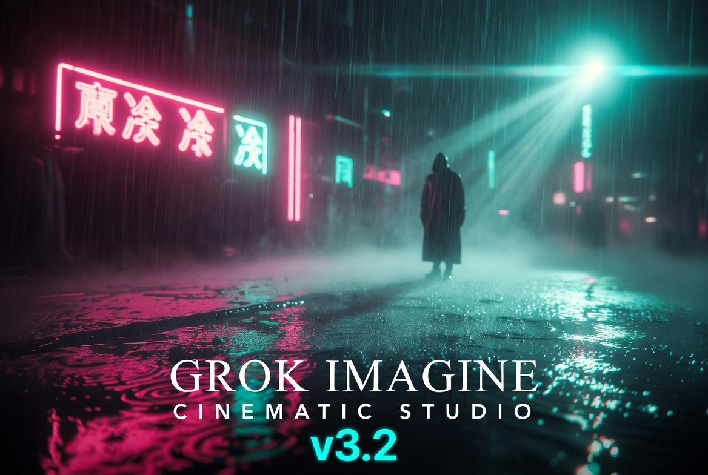

# Grok Imagine Cinematic Studio v3.2

  

  
  
  
  
  

<h1 align="center">Grok Imagine Cinematic Studio</h1>
<h3 align="center">v3.2 — May 2026</h3>

  <strong>The most advanced multi-agent cinematic production system for Grok 4.3 Beta</strong> 
  <em>Character Consistency • Native Sequence Mode • Reference Image Layer • One-Click Execution</em>

  <a href="#quick-start">Quick Start</a> • 
  <a href="#whats-new-in-v32">What's New</a> • 
  <a href="#prompt-modes">Prompt Modes</a> • 
  <a href="#key-features">Features</a>

---

## What's New in v3.2

| Feature                        | Description |
|--------------------------------|-------------|
| **Character Consistency Engine v2.0** | New **Identity Lock Specialist** + **Character DNA Bible** + **Character Drift Score** (0–10) |
| **Native Sequence Mode**       | Built-in multi-clip generation with automatic stitching instructions for 60–120+ second sequences |
| **Reference Image Management Layer** | Clear handling of Primary Character, Style, and Mood references with proper weighting |
| **One-Click Execution Commands** | `EXECUTE FIRST CLIP`, `START FULL SEQUENCE`, `GENERATE ALL REFERENCE IMAGES` — ready to copy |
| **Director Signature System**  | Activate cinematic voices (Villeneuve, Deakins, Wong Kar-wai, etc.) |
| **Quality Assurance Guardian v3.2** | Expanded 12-point review including Character Drift Score and Sequence Feasibility |

---

## Quick Start

### Recommended: Hybrid Mode (Most Users)

1. Copy the content of **`MASTER_PROMPT_HYBRID_MODE_v3.2.md`**
2. Paste it into Grok
3. Type: `Activate Grok Imagine Cinematic Studio v3.2`
4. Choose your workflow or simply describe your vision

### Full Power Mode

1. Copy **`MASTER_PROMPT_v3.2.md`**
2. Paste into Grok
3. Type: `Activate Grok Imagine Cinematic Studio v3.2`

### Maximum Control (Agent Mode)

1. Copy **`MASTER_PROMPT_AGENT_MODE_v3.2.md`**
2. Use commands like `START NEW PROJECT`, `DEFINE CHARACTER DNA`, `RUN QA REVIEW`

---

## Prompt Modes

| Mode              | Best For                          | Style                  |
|-------------------|-----------------------------------|------------------------|
| **Hybrid Mode**   | Most users (Recommended)          | Flexible + Structured  |
| **Full Mode**     | Complete one-shot productions     | Narrative & Detailed   |
| **Agent Mode**    | Maximum precision & control       | Strict command-based   |

---

## Key Features

- **13 Specialized Agents** with shared Studio State
- **Mandatory Quality Assurance Guardian** (12-point review)
- **Character DNA System** — Lock character identity across clips
- **Sequence Director** — Native long-form multi-clip support
- **Self-Evaluation Layer** on every output
- **Director Signature** — Apply specific cinematic styles
- **One-Click Commands** for fast iteration
- Optimized for **Grok 4.3 Beta** video generation

---

## Files Included

- `MASTER_PROMPT_v3.2.md` — Full powerful version
- `MASTER_PROMPT_HYBRID_MODE_v3.2.md` — Recommended flexible version
- `MASTER_PROMPT_AGENT_MODE_v3.2.md` — Strict agent command version
- `CHANGELOG_v3.2.md` — Full release notes

---

## Roadmap

- [x] Character Consistency Engine v2.0
- [x] Native Sequence Mode
- [x] Reference Image Management
- [ ] Web UI for Bible editing
- [ ] Automatic video stitching script
- [ ] Community Agent Marketplace

---

## License

MIT License — Feel free to use, modify, and share.

---

**Made with ❤️ for the Grok community**

*Transform any idea into emotionally powerful, production-ready cinematic experiences.*
