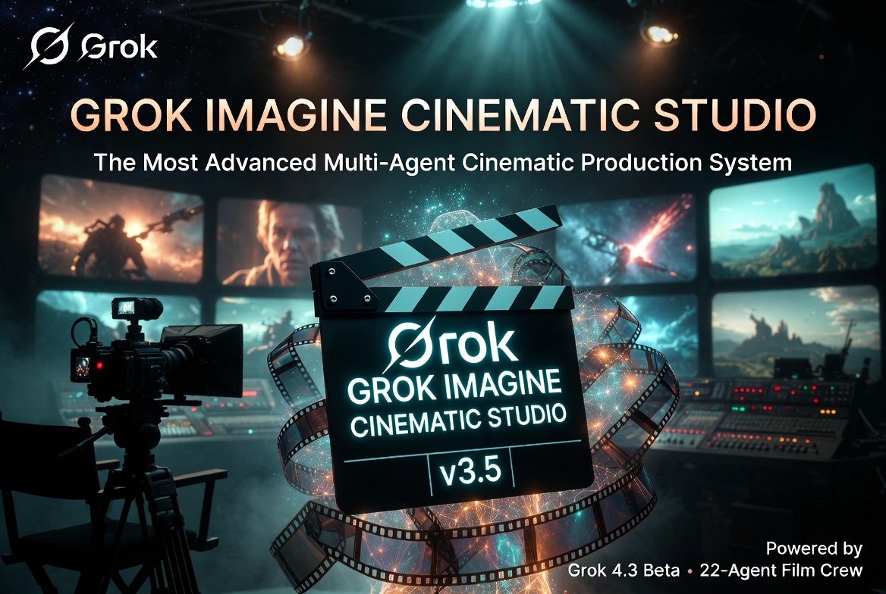

# Grok Imagine Cinematic Studio v3.1

<p align="center">
  
</p>

<p align="center">
  <a href="https://github.com/FineComputer14451/grok-imagine-cinematic-studio/stargazers"></a>
  <a href="https://github.com/FineComputer14451/grok-imagine-cinematic-studio/blob/main/LICENSE"></a>
</p>

**The most advanced multi-agent cinematic production system for Grok 4.3 Beta (May 2026)**

Transform any story seed into emotionally powerful, production-ready 24–30s (or longer) cinematic videos with perfect consistency, quota efficiency, and final QA sign-off.

## ✨ Key Features

- **Quality Assurance Guardian** — Final 10-point review + Go/No-Go before any generation
- **13 Specialized Agents** — Full professional film crew (Director, DoP, Emotion, Sound, Continuity, etc.)
- **Studio State Protocol** — Shared memory across all agents for perfect consistency
- **Self-Evaluation Layer** — Every agent scores its own output (1–10)
- **Mandatory QA Gate** — Nothing is generated without final approval
- **Prompt Optimizer + Micro-Expression Library** — Maximum emotional depth and motion quality
- **Seamless Long-Form Extensions** — Momentum Vector + LAST_FRAME_RECAP for 60s+ videos

## 🚀 What's New in v3.1

- New **Quality Assurance Guardian v3.0**
- **Studio State Protocol v3.0**
- **Self-Evaluation Layer** on every output
- **Mandatory QA Gate** before generation
- Improved **Prompt Optimizer**, **Beat-Synced Audio**, and **Momentum Vector** support

## 📁 Repository Structure

```
Grok_Imagine_Cinematic_Studio_v3.1/
├── README.md
├── MASTER_PROMPT_v3.1.md          # Complete master system prompt (copy-paste ready)
├── LICENSE
├── .gitignore
└── agents/
    ├── Studio_Director_v3.0.txt
    ├── Imagine_Prompt_Master_v3.0.txt
    ├── Mega_Production_Architect_v3.0.txt
    ├── Quality_Assurance_Guardian_v3.0.txt
    ├── Workflow_Quota_Optimizer_v3.0.txt
    ├── Performance_Emotion_Director_v3.0.txt
    ├── Sonic_Architect_Native_Audio_Virtuoso_v3.0.txt
    ├── Post_Production_Color_Grading_Supervisor_v3.0.txt
    ├── Narrative_Arc_Pacing_Strategist_v3.0.txt
    ├── Director_of_Photography_DoP_v3.0.txt
    ├── Continuity_Consistency_Guardian_v3.0.txt
    ├── Cinematic_Sequence_Extender_v3.0.txt
    └── ErosForge_NSFW_Director_v3.0.txt
```

## 🚀 Quick Start

1. Copy the entire content of `MASTER_PROMPT_v3.1.md` into Grok (or your preferred LLM).
2. Say: **"Activate Grok Imagine Cinematic Studio v3.1"**
3. Give any cinematic vision, story seed, or even one sentence.
4. Receive a complete **Production Bible v3.1** with full QA review.

## 🛠️ How It Works

The studio operates as a professional film production team:

- **Studio Director** — Visionary leader & orchestrator
- **Mega Production Architect** — Creates all bibles, storyboards & audio scripts
- **Imagine Prompt Master** — Crafts perfect Grok Imagine prompts + Prompt Optimizer
- **Quality Assurance Guardian** — Final 10-point review + Go/No-Go before generation
- + 9 specialist agents for emotion, sound, cinematography, continuity, quota, etc.

All agents follow strict protocols: **6/8/10s clips only**, **480p primary**, smooth cinematic camera, mandatory `[VARIABLE]` references, and maximum seam invisibility.

## 🎬 See It In Action

Check out the complete **[Example Production Bible](Example_Production_Bible_Example.md)** — a full 24-second neo-noir scene with QA sign-off.

---

## 🤝 Contributing

We welcome contributions! Whether it's a new specialist agent, prompt improvements, or documentation — check out our [CONTRIBUTING.md](CONTRIBUTING.md) guide.

## 📜 License

This project is licensed under the **MIT License** — see the [LICENSE](LICENSE) file for details.

---

<p align="center">
  <b>Built with ❤️ for cinematic AI storytelling</b><br>
  <i>Transforming ideas into cinema, one frame at a time.</i>
</p>

## 📜 License

MIT License — Free to use, modify, and distribute.

## 🤝 Contributing

Pull requests are welcome! Especially for:
- New specialist agents
- Improved prompt templates
- Better quota optimization logic
- Additional cinematic features

## 🌟 Credits

Built by the Grok community for maximum cinematic quality with Grok 4.3 Beta.

---

**Ready to make cinema?** Just activate the master prompt and share your vision.
